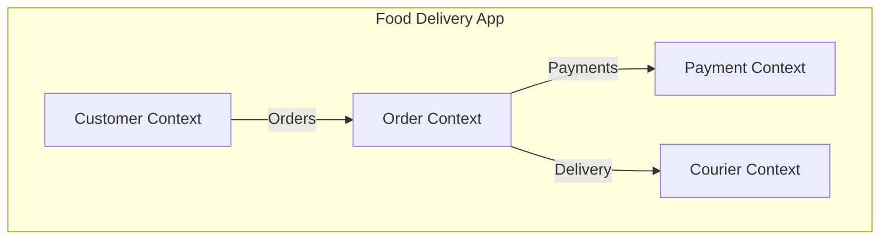
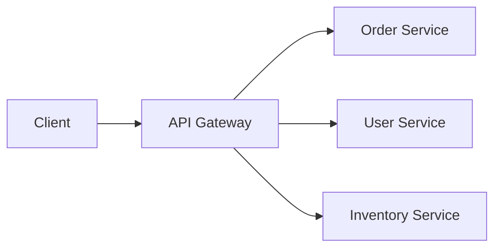

# Module 1: Microservices Architecture Research

Microservices architecture is an approach to building a single application as a suite of small services, each running in its own process and communicating with lightweight mechanisms, often an HTTP resource API.

## 1. Monolith vs. Microservices

### Monolithic Architecture
A single, unified unit. All components (UI, business logic, data access) are packaged and deployed together.

*   **Pros**: Simplicity in development, testing, and deployment (initially).
*   **Cons**: Scaling difficulties, technology lock-in, long build times, risk of a single point of failure (one bug can crash the whole app).

### Microservices Architecture
A collection of small, independent services organized around business capabilities.

*   **Pros**: Independent scaling, technology diversity, fault isolation, faster delivery (CI/CD).
*   **Cons**: Complexity in distributed systems, data consistency challenges, operational overhead.

### When to Use?
| Monolith | Microservices |
| :--- | :--- |
| Small teams (1-10 people) | Large organizations with many teams |
| Simple domain requirements | Complex domains with distinct sub-domains |
| Need for fast initial prototyping | Need for independent service scaling |
| Low operational maturity | High DevOps/Automation maturity |

---

## 2. Service Decomposition Strategies

Decomposing a system into services is the most critical design challenge.

### By Business Capability
Corresponding to the business functions (e.g., Order Management, Shipping, Payment).

### By Bounded Context (Domain-Driven Design)
Using DDD concepts to identify boundaries within the domain model. Each service owns its own data and logic for a specific "context."

---

## 3. Inter-Service Communication

### Synchronous (Request/Response)
- **REST (HTTP/JSON)**: Simple, industry standard, human-readable.
- **gRPC (Protocol Buffers)**: High performance, strongly typed, ideal for internal service-to-service communication.

### Asynchronous (Message-Based)
- **Message Queues (RabbitMQ, Kafka)**: Decouples services, improves resilience, and handles traffic spikes.
- **Patterns**: Pub/Sub, Worker Queues.

---

## 4. Architectural Patterns

### API Gateway Pattern
A single entry point for all clients. Handles routing, authentication, rate limiting, and protocol translation.

### Service Discovery
Allows services to find each other dynamically without hardcoded IP addresses.
- **Client-Side**: Client queries the registry (e.g., Netflix Eureka).
- **Server-Side**: Load balancer queries the registry (e.g., AWS ALBs, Kubernetes Services).

### Database Per Service
Each service has its own private database. This ensures loose coupling and allows each service to use the database best suited for its needs (Polyglot Persistence).

---

## 5. Challenges and Mitigation
- **Distributed Transactions**: Solved using the **Saga Pattern** or Two-Phase Commit (rare).
- **Service Failures**: Solved using **Circuit Breakers** (e.g., Resilience4j) and Retries.
- **Observability**: Crucial for debugging distributed systems (Tracing, Logging, Metrics).
