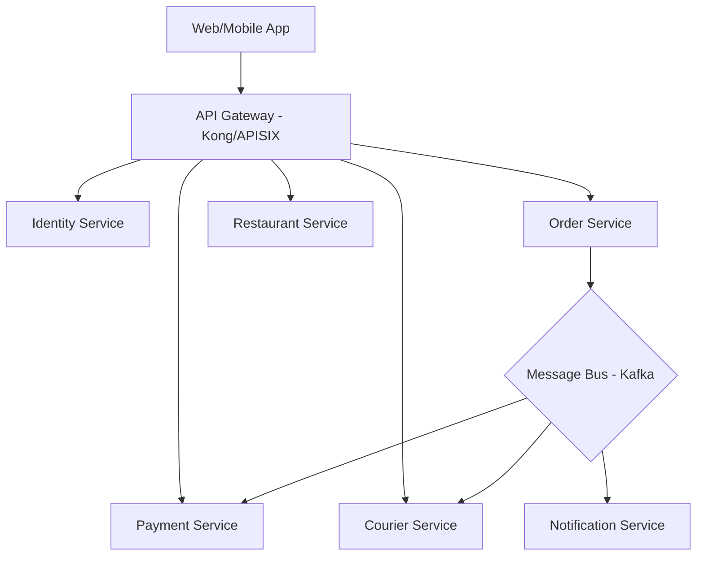

# Module 5: System Architecture Design (Food Delivery Application)

This document outlines the high-level architecture for a scalable, resilient food delivery platform similar to UberEats or DoorDash.

## 1. High-Level Architecture Overview

We adopt a **Microservices Architecture** with an **Event-Driven Core** to ensure scalability and fault tolerance.



## 2. Microservices Breakdown

### Identity Service
- **Responsibility**: User registration, authentication (OAuth2/OIDC), profile management.
- **Tech**: Go, PostgreSQL, Redis (session).

### Restaurant Service
- **Responsibility**: Menu management, availability, location indexing.
- **Tech**: Node.js/TypeScript, PostgreSQL (PostGIS for geo-queries), Elasticsearch (for menu search).

### Order Service
- **Responsibility**: Cart management, order lifecycle (creating, updating states).
- **Tech**: Java/Spring Boot or Python/FastAPI, PostgreSQL.

### Payment Service
- **Responsibility**: Processing transactions, integrating with Stripe/PayPal.
- **Tech**: Go (for performance and safety), PostgreSQL (audit logs).

### Courier Service
- **Responsibility**: Tracking real-time locations of drivers, matching drivers to orders.
- **Tech**: Go or Rust (performance), Redis (for high-frequency location updates), WebSockets.

## 3. Database Strategy (Polyglot Persistence)
Each service owns its data and uses the best-suited engine:
- **Relational (PostgreSQL)**: Orders, Payments, Profiles (Transactional data).
- **In-Memory (Redis)**: Live driver locations, caching, rate limiting.
- **Search (Elasticsearch)**: Restaurant and menu search.
- **Object Storage (S3)**: Restaurant images, receipt PDFs.

## 4. API Design (OpenAPI Snippet)

```yaml
openapi: 3.0.0
info:
  title: Food Delivery Order API
  version: 1.0.0
paths:
  /orders:
    post:
      summary: Place a new order
      requestBody:
        content:
          application/json:
            schema:
              type: object
              properties:
                restaurant_id: {type: string}
                items: 
                  type: array
                  items: {type: string}
                address: {type: string}
      responses:
        '201':
          description: Order created
          content:
            application/json:
              schema:
                $ref: '#/components/schemas/Order'
```

## 5. Event-Driven Flow (Example: Order Placement)
1. **User** clicks "Place Order".
2. **Order Service** creates an order in `PENDING` state and publishes an `OrderCreated` event to Kafka.
3. **Payment Service** consumes the event, processes the card, and publishes `PaymentSuccessful`.
4. **Order Service** consumes `PaymentSuccessful`, updates state to `PAID`.
5. **Restaurant Service** & **Courier Service** are notified to start their respective workflows.

## 6. Real-time Communication
- **WebSockets** for live order tracking on the client app.
- **GPS Updates** from courier app sent to `Courier Service` every 5 seconds.
